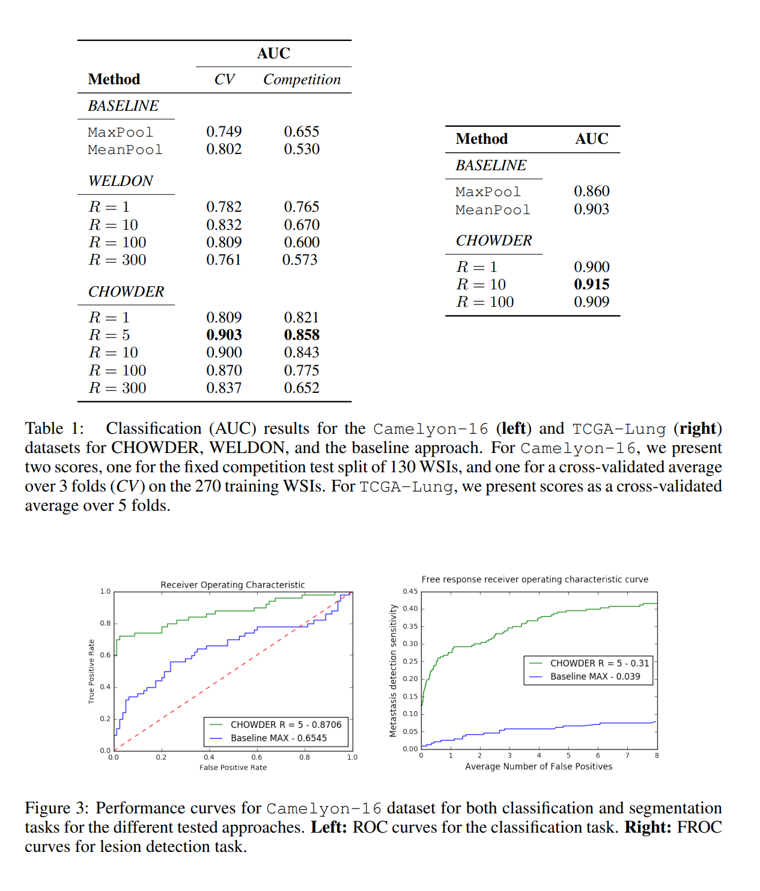

# Report

## Table of Contents

- [Article understanding](#Article-understanding)
- [Implementation](#Implementation)

## Article understanding

The article titled "Classification and Disease Localization in Histopathology Using Only Global Labels: A Weakly-Supervised Approach" authored by Pierre Courtiol, Eric W. Tramel, Marc Sanselme, and Gilles Wainrib from Owkin, Inc., New York City, investigates into histopathology, which involves diagnosing and studying tissue diseases by examining them under a microscope. Specifically, the focus is on oncology histopathology.

### Introduction

Histopathological image analysis (HIA) serves as the  gold standard in oncology deep learning. However, its high cost is due to the fact that pathologists must analyse pixel by pixel segmentation maps of diseased tissue at extreme resolution to create annotations.
As a result, HIA datasets are often small, leading to weakly supervised learning methods due to limited ressources. 
The Chowder model introduced in this study addresses this challenge by using features generated by a ResNet50 as inputs.
Multiple Instance Learning (MIL) is employed here because whole slide images (WSI) are commonly processed digitally in tiles. The aggregation of these tiles into groups with a single label ("healthy" or "cancer present") assumes that the slide is considered to have "cancer present" if one or more tiles are labeled as such.

### WSI pre-processing

During pre-processing, only tiles within the foreground segmentation are extracted for training purposes. Then the color normalization is performed to prevents variations in staining between slides. Finally, the process of tiling is implemented. The study mentions the use of the ResNet-50 architecture, which has been trained on the ImageNet natural image dataset, to produce one feature vector of dimensionality 2048 for each tile.

### Method

For the baseline method, MaxPooling and mean pooling techniques are used to obtain a single feature descriptor representing the entire image. Following the aggregation, a classifier is trained to generate the desired diagnosis labels. In this case, a logistic regression model is used for the final prediction layer of the model. This method is not accurate for diffuse disease. Here, diffuse implies that the number of disease-containing tiles, pertinent to the diagnosis label, are roughly proportional
to the number of tiles containing healthy tissue.

The Chowder method, which is the principal point of interest, draws inspiration from the WELDON architecture. Similar to the baseline approach, the features generated by ResNet-50 are used by Chowder. However, Chowder employs a convolution operation on the local descriptor to transform it into an number of tiles×1 vector. This vector is then sorted by value, and only the maximum and minimum values are retained. The number of retain value depends on the parameter (2 on figure2). These values represent the tiles with the highest and lowest probabilities of disease presence, respectively. As a result, these values are inserted into a Multi-Layer Perceptron (MLP) classifier, which outputs the probability that the slide contains the disease.

### Experimental results

### Training Details

To address overfitting, strong regularization techniques are employed in the Chowder method. An L2 regularization of 0.5 is applied on the convolution feature embedding layer, and dropout with a rate of 0.5 is used on the MLP. Training is conducted using the Adam optimizer to minimize the binary cross-entropy loss over 30 epochs, with a mini-batch size of 10 and a learning rate of 0.001.

To reduce variance and prevent overfitting, an ensemble of E Chowder networks is trained, each differing only by their initial weights. The final prediction is established by averaging the predictions made by these E networks. For Table S1, E is set to 10, while for the Camelyon-16 leaderboards, E is set to 50 with R = 5. E is set to 10 for the WELDON results.
There are two challenges. 

The first challenge, TCGA, provides 11,000 tissue slide images of cancers from various organs. The study focuses on 707 lung cancer slides (TCGA-lung), predicting whether each slide contains adenocarcinoma or squamous cell carcinoma. Classification quality is evaluated based on the area under the curve (AUC) of the receiver operating characteristic (ROC) curve generated using the raw output predictions. 

The second challenge, Camelyon-16, provides labeling and segmentation masks for each WSI, representing expert analysis on the location of metastases within the slide. Only diagnosis labels are used, and the segmentation masks are set aside. Evaluation of the Camelyon-16 dataset is conducted on two axes, the accuracy of the predicted label for each wsi based on AUC and the accuracy of metastasis localization, evaluated by comparing model outputs to the ground-truth expert annotations of metastasis location using free ROC metric (FROC).

Here are the results:

The study has demonstrated that leveraging state-of-the-art techniques from Multiple Instance Learning (MIL) in computer vision, allows for the construction of an effective technique for both diagnosis prediction and disease location within Whole Slide Images (WSI) in histopathology, all without the requirement of expensive localized annotations produced by expert pathologists.

However, there remains improvements in the CHOWDER method, particularly in the generation of disease localization maps.

## Implementation

### Objectives

- Train Chowder
- Predict on dataset
- Ensemble Chowder

### Python Setup

To start the PIK3CA mutation detection challenge, I began reading the article and summarized its contents as I did above. Following this, I explored the provided code repository named "HistoSSLscaling," which contains the Chowder Model. Setting up my environment was the first step, which involved installing the necessary requirements from the requirements.txt. Then, I encountered an issue with the setup.py of the Chowder repository, so I had to add it as a Git submodule to use it.

In the provided code, I realized many interesting classes for my project as:

 - The Chowder class to instanciate the model
 - The Datasets class to instanciate required datasets
 - The Trainer to train the model

### Training Pipeline

I then started to code in a notebook environment to get a better visual on what I was doing. 
I initialized Chowder, fitted the data, and use the trainer on the model. Aftewards, I realized the tensor predictions was filled with negative values. I applied sigmoid to squash the output to get probabilities between 0 and 1 that I finally transformed into a csv file. 
This gave me a metric score of 0.7151, securing the third position on the historic challenge leaderboard with my first submission.
The parameters used for this first result were the default ones:

- Chowder Model parameters:

    - in_features=2048
    - out_features=1
    - n_top=5
    - n_bottom=5
    - mlp_hidden=[200, 100]
    - mlp_dropout=None
    - mlp_activation=torch.nn.Sigmoid()
    - bias=True

- Trainer parameters:

    - model=Chowder
    - criterion=BCEWithLogitsLoss
    - metrics={'auc': auc}
    - device=cuda
    - optimizer=Adam
    - batch_size=16
    - num_epochs=15
    - learning_rate=0.001
    - weight_decay=0.0

Then, I focused on refactoring my code for clarity and establishing a good project architecture. To maintain clean code, I used a Continuous Integration (CI), including these tools such as :

- Black, a code formatter that automatically formats Python code to adhere to the PEP 8 style guide.
- Pylint, a static code analysis tool that checks Python code for errors, potential bugs, and adherence to coding standards outlined in PEP 8
- Pytest, a testing framework in Python used for writing and executing unit tests, allowing developers to easily create and run tests for their code.
- Mypy, a static type checker for Python, enabling developers to enforce and check type annotations in Python code, enhancing code quality and catching potential type-related errors.

I finally developed a script allowing Command Line Interface (CLI) usage for model training with the ability to specify desired hyperparameters using arguments parsing. (Cf. [Training](../README.md#training) in REAMDE.md)

### Ensemble

Ensemble learning in machine learning refers to a technique where multiple models are trained to solve the same problem, and their predictions are combined to improve overall performance. This approach aims to reduce the risk of errors and variance, leading to more accurate and robust predictions compared to individual models.

By leveraging diverse model selection, reducing overfitting, and improving generalization, ensembles often outperform individual models. 
They are more robust to noise, offer error correction, and demonstrate improved performance stability across different datasets. 

Ensemble methods can be highly effective in the medical field because we prioritize achieving the correct diagnosis for the patient, there are no contraints of response time for prediction.

First, I saved the weights of two models in a directory at the root of the project (`weights` directory) using the train.py script. Afterward, I used a notebook to load the models along with their weights. I then computed the average of theses predictions.

To simplify ensemble training similar to the train.py script, I created an ensemble.py CLI script that can be used with many models. The parameters can be specified for the models, but they have to be the same for each of them. 
For more information, please refer [Ensemble Prediction](../README.md#Ensemble-Prediction) in the README.md file.

I tried to reproduce the experiment of the paper, using 50 chowders with differents weights initialization but unfortunately, the result was not relevant.

### Solutions

- Test with different ensemble sets
- Test ensemble predictions with different Chowder hyperparameters
- Hyperparameters Tuning (process of adjusting the settings of machine learning algorithms to optimize its performance on a given dataset)
